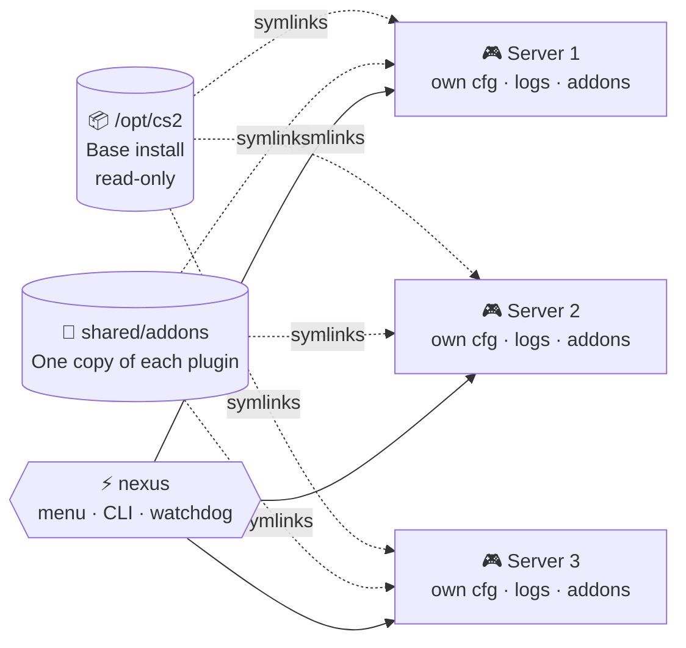

<div align="center">

**🌐 زبان:** &nbsp; [🇬🇧 English](README.md) &nbsp;|&nbsp; 🇮🇷 **فارسی**


<br>

# ⚡ CS2NEXUS

### مدیر و لانچر همه‌کاره برای سرورهای Counter-Strike 2

*چندین سرور اختصاصی CS2 را از یک منو بسازید، اجرا کنید، تنظیم کنید و نگه‌داری کنید —<br>با پلاگین‌های مشترک، نصب تک‌کلیکی، آپدیت خودکار و واچ‌داگی که هیچ‌وقت نمی‌خوابد.*

<br>


<br>

**[🚀 شروع سریع](#-شروع-سریع)** &nbsp;·&nbsp;
**[✨ امکانات](#-امکانات)** &nbsp;·&nbsp;
**[🧭 منو](#-منو)** &nbsp;·&nbsp;
**[💻 خط فرمان](#-استفاده-از-خط-فرمان)** &nbsp;·&nbsp;
**[🔌 پلاگین‌ها](#-پلاگین‌های-مشترک)** &nbsp;·&nbsp;
**[❓ سؤالات متداول](#-سؤالات-متداول)**

</div>

<div dir="rtl">

---

## 🚀 چرا CS2Nexus؟

اجرای چند سرور CS2 معمولاً یعنی:

| ❌ روش قدیمی | ✅ با CS2Nexus |
|---|---|
| کپی‌کردن **بیش از ۶۰ گیگابایت** فایل بازی برای هر سرور | **یک** نصب پایه که با symlink بین همه به اشتراک گذاشته می‌شود؛ هر سرور جدید فقط چند مگابایت |
| مدیریت دستی نشست‌های `tmux` | شروع / توقف / اتصال از یک منو |
| آپدیت پلاگین‌ها سرور به سرور | **یک نسخه** از هر پلاگین، لینک‌شده به همهٔ سرورها |
| ویرایش `server.cfg` به امید اینکه کانفیگ مود بازی آن را بازنویسی نکند | یک بلاک مدیریت‌شده **به‌همراه** فایل‌های override که همیشه برنده‌اند |
| فهمیدن کرش سرور از بازیکنان عصبانی | یک **واچ‌داگ** که خودش سرور را ری‌استارت می‌کند |

**یک لانچر. همهٔ سرورها. بدون دردسر.**

---

## 🧩 نحوهٔ کار



---

## ✨ امکانات

### 🖥️ مدیریت سرور
- ساخت، شروع، توقف، ری‌استارت و حذف سرور از طریق منو
- چند سرور روی یک ماشین — هرکدام با **پورت، نام، مپ و حداکثر کلاینت** مخصوص خود
- **پشتیبانی از مپ‌های Workshop** — نام مپ، شناسهٔ Workshop یا لینک Steam Workshop را وارد کنید
- پشتیبانی از **توکن GSLT** برای هر سرور (`sv_setsteamaccount`)
- **لیست بازیکنان** زنده و **تاریخچهٔ ورود/خروج** از روی لاگ‌های بازی
- اجرا داخل `tmux`؛ با بستن SSH سرورها زنده می‌مانند

### 💾 مصرف هوشمند دیسک
- یک نصب پایهٔ CS2 (`/opt/cs2`) که با symlink بین همهٔ سرورها مشترک است
- هر سرور `cfg`، `addons`، `logs` و فایل‌های لانچر واقعیِ خودش را دارد
- فایل‌های پایه **هرگز** توسط مدیر تغییر نمی‌کنند

### 🔌 سیستم پلاگین مشترک
- یک نسخه از هر پلاگین، لینک‌شده به همهٔ سرورها
- **کشف خودکار با Drop-folder** — پلاگین را در پوشهٔ مشترک بگذارید تا خودکار ثبت شود
- حالت‌های داده برای هر سرور: **مستقل**، **مشترک** یا **سفارشی (به‌ازای هر فایل)**
- نصب پلاگین روی همهٔ سرورها، فقط سرورهای انتخابی، یا همه به‌جز بعضی
- **مرورگر پلاگین** داخلی که مستقیم از GitHub می‌خواند
- تایمر **آپدیت خودکار** با بکاپ خودکار نسخه‌های قدیمی

### ⚙️ موتور تنظیمات سرور
- **بیش از ۱۵۰ cvar مستندشده** در دسته‌بندی‌های مختلف (راند، اقتصاد، ویس، رأی‌گیری، بات، GOTV، حرکت و ...)
- **گزینه‌های سریع:** bunny hop، مهمات بی‌نهایت، friendly fire، all-talk، respawn، خرید از همه‌جا و ...
- **پریست‌ها:** سرور رایگان، بدون رأی‌گیری، بدون فروشگاه، بدون دراپ، فقط هدشات و ...
- انتخاب مود بازی، زمان راند و کنترل warmup
- تنظیمات پیش‌فرضی که هر سرور جدید به ارث می‌برد
- کانفیگ داخل یک بلاک مدیریت‌شده در `server.cfg` نوشته می‌شود، به‌علاوهٔ فایل‌های override برای مودهای بازی تا کانفیگ مودها بی‌صدا مقادیر شما را بازنویسی نکنند
- **اکشن‌های زنده:** پایان warmup، pause، ری‌استارت بازی، جابه‌جایی و بُر زدن تیم‌ها
- **بررسی** اینکه سرور در حال اجرا واقعاً از چه مقادیری استفاده می‌کند

### 🛡️ پایداری
- **واچ‌داگ** — سرورهای کرش‌کرده را (با محدودیت نرخ ری‌استارت) ری‌استارت می‌کند و سروری را که عمداً متوقف کرده‌اید هرگز دوباره روشن نمی‌کند
- **ری‌استارت زمان‌بندی‌شده** با هشدار خودکار ۵ دقیقه و ۱ دقیقه قبل به بازیکنان
- **آپدیت CS2 از طریق SteamCMD** با شمارش معکوس، توقف امن، آپدیت و ری‌استارت
- **آپدیت خودکار لانچر** از GitHub با اعتبارسنجی سینتکس و مارکر و بکاپ خودکار
- نوشتن اتمیک فایل‌های JSON با بکاپ چرخشی

### 👑 مدیریت ادمین‌ها
- یک صفحهٔ **Admins** برای همهٔ سرورها — دیگر لازم نیست `admins.json` را دستی ویرایش کنید
- تبدیل یک ادمین به **ادمین پیش‌فرض**: روی همهٔ سرورها نوشته می‌شود، حتی سرورهایی که بعداً ساخته می‌شوند
- یا محدودکردن ادمین به **سرورهای انتخابی**
- **انتخاب دسترسی‌ها** برای هر ادمین، به‌همراه سطح immunity و تگ چت
- فایل‌های کانفیگ ادمین CounterStrikeSharp را مستقیم و با اعتبارسنجی می‌نویسد

### 📊 مانیتور زندهٔ منابع
- نمایش لحظه‌ای **CPU، RAM و دیسک** درون خود منو
- نمای خودکار-به‌روزشونده — برای بازگشت `q` یا `Enter` بزنید
- قبل از اینکه بازیکنان متوجه شوند، سنگین‌شدن ماشین را ببینید

### 🧰 اتوماسیون
- خط فرمان کامل و غیرتعاملی برای **cron، systemd یا پنل وب**
- خروجی `--json` برای دستورهای list و status

---

## 📋 پیش‌نیازها

| | نیازمندی |
|---|---|
| 🐧 **سیستم‌عامل** | Ubuntu 22.04 (سیستم‌های مبتنی بر Debian هم ممکن است کار کنند) |
| 🔑 **دسترسی** | `root` (یا `sudo`) |
| 💽 **دیسک** | حدود ۶۵ گیگابایت فضای خالی برای نصب پایهٔ CS2 |
| 🌐 **شبکه** | دسترسی اینترنت برای SteamCMD و GitHub |

لانچر وابستگی‌های خودش (`jq`، `tmux`، `curl`، `unzip`، `tar` و غیره) را بررسی می‌کند و هر چیزی که نصب نباشد را پیشنهاد نصب می‌دهد.

---

## ⚡ شروع سریع

</div>

```bash
# 1. Download the launcher
sudo curl -L -o /opt/nexus.sh \
  https://raw.githubusercontent.com/NEPENTII/CS2Nexus/main/launcher/nexus.sh

# 2. Make it executable
sudo chmod +x /opt/nexus.sh

# 3. (Optional) install the short commands "nexus" and "cs2"
sudo /opt/nexus.sh --install

# 4. Run it
sudo nexus
```

<div dir="rtl">

در اولین اجرا، یک **ویزارد راه‌اندازی** این کارها را انجام می‌دهد:

1. 👤 ساخت کاربر سیستمی `cs2`
2. 📥 پیدا کردن فایل‌های موجود سرور CS2 یا نصب SteamCMD و دانلود آن‌ها
3. 🎮 ساخت اولین سرور با تنظیمات پیش‌فرض
4. 🧱 نصب اختیاری **Metamod:Source** و **CounterStrikeSharp**
5. 🔌 نصب اختیاری پلاگین‌های پیش‌فرض (**ServerCommands, MapVote, Parachute, AstraSkins**)
6. 🐕 فعال‌سازی اختیاری **واچ‌داگ** برای ری‌استارت خودکار

> 💡 **نکته:** دانلود اولیهٔ CS2 حجیم است (بیش از ۶۰ گیگابایت). اگر تلاش اول شکست بخورد، ویزارد SteamCMD را خودکار دوباره اجرا می‌کند.

---

## 🧭 منو

</div>

```text
╔══════════════════════════════════╗
║            CS2 NEXUS             ║
║     Server Manager & Launcher    ║
╚══════════════════════════════════╝

  1) Create Server          9) Plugins
  2) Start Server          10) Server Settings
  3) Stop Server           11) Server Console
  4) Restart Server        12) Log Viewer
  5) List Servers          13) Maintenance
  6) Server Status         14) Admins
  7) Delete Server         15) Resource Monitor (live)
  8) Players & History     16) Exit
```

<div dir="rtl">

| بخش | کارکرد |
|---|---|
| 🖲️ **کنسول** | اتصال (کامل یا فقط‌خواندنی)، ارسال یک دستور، یا پخش پیام به همهٔ سرورهای در حال اجرا |
| 📜 **نمایشگر لاگ** | مشاهده یا دنبال‌کردن زندهٔ لاگ بازی و خروجی کنسول (کاراکترهای کنترلی حذف می‌شوند) |
| 🧰 **نگه‌داری** | آپدیت CS2، ری‌استارت زمان‌بندی‌شده، واچ‌داگ، بکاپ JSON، آپدیت لانچر، تنظیمات لانچر |
| 👑 **ادمین‌ها** | دیدن همهٔ ادمین‌ها در تمام سرورها، تبدیل به ادمین پیش‌فرض، محدودکردن به سرورهای انتخابی، ویرایش دسترسی‌ها، immunity و تگ |
| 📊 **مانیتور منابع** | نمایش زندهٔ مصرف CPU / RAM / دیسک — برای بازگشت `q` یا `Enter` بزنید |

> 🚪 برای خروج از کنسول متصل‌شده **بدون** متوقف‌کردن سرور، **`Ctrl+B`** و سپس **`D`** را بزنید.

---

## 💻 استفاده از خط فرمان

</div>

```bash
nexus list [--json]           # list servers and their state
nexus status [ID] [--json]    # status with player counts
nexus start ID                # start a server
nexus stop ID                 # stop a server
nexus restart ID              # restart a server
nexus sync [--dry-run]        # register dropped plugins and sync all servers
nexus say ID MESSAGE...       # send "say" to one server
nexus broadcast MESSAGE...    # send "say" to all running servers
nexus watchdog                # start offline autostart servers (used by the timer)
nexus plugin-update           # update plugins from the Plugin Browser (used by the timer)
nexus help                    # show help
```

<div dir="rtl">

> نام کوتاه `cs2` دقیقاً مثل `nexus` کار می‌کند.

| کد خروج | معنی |
|:---:|---|
| `0` | ✅ موفق |
| `1` | ⚠️ خطا یا مواردی که رد شدند |
| `2` | ❌ خطای استفاده |

با `--json` **فقط JSON** روی `stdout` چاپ می‌شود و همهٔ پیام‌های قابل‌خواندن برای انسان به `stderr` می‌روند، پس به‌راحتی پایپ می‌شود:

</div>

```bash
nexus status --json | jq '.[] | {name, port, status, players}'
```

<div dir="rtl">

<details>
<summary>⏰ <b>نمونهٔ cron — اعلام ری‌استارت هر شب</b></summary>

</div>

```cron
55 3 * * * /usr/local/bin/nexus broadcast "Server restarts in 5 minutes!"
```

<div dir="rtl">

</details>

---

## 🔌 پلاگین‌های مشترک

پلاگین‌ها **فقط یک‌بار** در این مسیر قرار می‌گیرند:

</div>

```text
/opt/cs2-servers/shared/addons/
├── counterstrikesharp/plugins/<PluginName>
└── metamod/plugins/<PluginName>
```

<div dir="rtl">

هر چیزی که در این پوشه‌ها بگذارید **خودکار ثبت می‌شود** و در sync یا استارت بعدی سرور به همهٔ سرورها لینک می‌شود.

### 🗂️ حالت‌های داده

| حالت | رفتار |
|---|---|
| 🔹 **مستقل** | هر سرور پوشهٔ `data` مخصوص خودش را دارد |
| 🔸 **مشترک** | همهٔ سرورها از همان داده‌های نسخهٔ مرکزی استفاده می‌کنند |
| 🔶 **سفارشی** | دقیقاً انتخاب می‌کنید کدام فایل‌ها یا پوشه‌ها برای هر سرور جدا بمانند (مثلاً `data/astra_skins.sqlite`) |

### 🎯 تخصیص

- ✅ همهٔ سرورها (پیش‌فرض — شامل سرورهایی که بعداً ساخته می‌شوند)
- 🎯 فقط سرورهای انتخابی
- 🚫 همهٔ سرورها **به‌جز** بعضی

### 🛒 مرورگر پلاگین و آپدیت خودکار

مرورگر داخلی، پلاگین‌ها را از پوشهٔ `plugins` در مخزن GitHub پروژهٔ CS2Nexus فهرست می‌کند، به‌علاوهٔ هر منبع release گیت‌هابی که خودتان اضافه کنید. تایمر **آپدیت خودکار** (هر ۳۰ دقیقه) را فعال کنید تا همه به‌روز بمانند. نسخه‌های قدیمی خودکار بکاپ می‌شوند و ۵ تای آخر نگه داشته می‌شوند.

> ⚠️ فقط پلاگین‌های تکی قابل اشتراک‌اند (`<prefix>/<PLUGIN>`). فایل‌های هستهٔ Metamod یا CounterStrikeSharp **هرگز** به اشتراک گذاشته نمی‌شوند.

---

## 🎛️ تنظیمات سرور

از منوی اصلی **Server Settings** را باز کنید. عدد `0` پروفایل **DEFAULT** است که سرورهای جدید از آن ارث می‌برند؛ یا یک سرور مشخص را انتخاب کنید.

| بخش | نمونه‌ها |
|---|---|
| 🏷️ **مبانی** | نام، پورت، حداکثر کلاینت، مپ شروع، GSLT |
| 🎮 **مود بازی** | Casual، Competitive، Wingman، Arms Race، Demolition، Deathmatch |
| ⚡ **گزینه‌های سریع** | bunny hop، مهمات/پول بی‌نهایت، friendly fire، all-talk، respawn، GOTV، چیت |
| 🎁 **پریست‌ها** | سرور رایگان، بدون رأی‌گیری، بدون timeout، بدون فروشگاه، بدون دراپ، فقط هدشات |
| 📚 **تنظیمات CFG** | همهٔ cvarها به‌تفکیک دسته، با توضیح و اعتبارسنجی |
| ✍️ **خطوط سفارشی** | هر دستور کنسول دلخواه |
| 🔴 **اکشن‌های زنده** | پایان warmup، pause/resume، ری‌استارت بازی، جابه‌جایی/بُر زدن تیم‌ها |
| 🔍 **بررسی** | از سرور در حال اجرا بپرسید واقعاً از چه مقادیری استفاده می‌کند |

---

## 🛠️ نگه‌داری

| کار | چه اتفاقی می‌افتد |
|---|---|
| 🔄 **آپدیت CS2** | با شمارش معکوس به بازیکنان هشدار می‌دهد ← سرورهای در حال اجرا را متوقف می‌کند ← SteamCMD را اجرا می‌کند ← `gameinfo.gi` را برای Metamod دوباره پچ می‌کند ← سرورها را دوباره روشن می‌کند |
| ⏱️ **ری‌استارت زمان‌بندی‌شده** | `HH:MM` یا `+N` دقیقه را انتخاب کنید؛ بازیکنان ۵ و ۱ دقیقه قبل هشدار می‌گیرند |
| 🐕 **واچ‌داگ / autostart** | یک تایمر systemd هر دقیقه بررسی می‌کند؛ حداکثر **۳ ری‌استارت در هر ۱۰ دقیقه** برای هر سرور |
| 💾 **بکاپ JSON** | بکاپ چرخشی از همهٔ فایل‌های رجیستری (۱۰ تای آخر نگه داشته می‌شوند) |
| 🚀 **آپدیت لانچر** | دانلود، اعتبارسنجی (shebang، مارکر، اندازه، `bash -n`)، بکاپ و جایگزینی لانچر، سپس ری‌استارت سرورهایی که روشن بودند |

---

## 📁 ساختار پوشه‌ها

</div>

```text
/opt/cs2/                         # Base CS2 install (never modified by servers)
/opt/cs2-servers/
├── servers.json                  # Server registry
├── <server-slug>/                # One folder per server (symlinks + real cfg/addons/logs)
└── shared/
    ├── addons/                   # Shared plugins (drop folders)
    ├── plugins.json              # Shared plugin registry
    ├── autostart.json            # Watchdog list
    ├── server-settings.json      # Default + per-server settings
    ├── backups/                  # JSON and plugin backups
    └── state/                    # Watchdog and manual-stop markers
/etc/cs2nexus.conf                # Launcher configuration
```

<div dir="rtl">

---

## ⚙️ پیکربندی

فایل `/etc/cs2nexus.conf` شامل خطوط ساده‌ی `KEY=VALUE` است. این فایل **پارس می‌شود، هرگز source نمی‌شود** و تک‌تک مقادیر اعتبارسنجی می‌شوند.

| کلید | توضیح |
|---|---|
| `BASE` | مسیر نصب پایهٔ CS2 |
| `NEXUS_REPO` / `NEXUS_BRANCH` | مخزن و شاخهٔ GitHub برای پلاگین‌ها و آپدیت لانچر |
| `EXTRA_PLUGIN_REPOS` | منابع release اضافه به‌شکل `owner/repo`، جداشده با کاما |
| `GITHUB_TOKEN` | توکن اختیاری برای مخزن‌های خصوصی یا محدودیت نرخ |
| `AUTOUPDATE` | مقدار `1` آپدیت خودکار پلاگین را فعال می‌کند |
| `UPDATE_ACTION` | `none` یا `reload` — بعد از آپدیت پلاگین روی سرورهای در حال اجرا چه شود |

بیشتر این موارد از **Maintenance ← Launcher settings** قابل تغییرند.

---

## 🔒 طراحی ایمن

CS2Nexus طوری ساخته شده که به داده‌های شما آسیب نزند:

- 🧱 اعتبارسنجی سخت‌گیرانهٔ مسیرها قبل از هر عملیات مخرب (`rm -rf` فقط با بررسی‌های ایمنی و `--one-file-system`)
- 🔗 فایل‌های واقعی پلاگین و symlinkهای بیگانه **هرگز بازنویسی نمی‌شوند**
- 📝 هر نوشتن JSON اعتبارسنجی، بکاپ و در فایل موقت نوشته و سپس به‌صورت اتمیک جابه‌جا می‌شود
- 🔐 یک قفل re-entrant مانع برخورد منو، cron و تایمرها می‌شود
- 🚫 File descriptorهای قفل برای `tmux` بسته می‌شوند تا هرگز به سرورهای بازی نشت نکنند
- 📦 بسته‌های پلاگین دانلودشده در صورت داشتن symlink یا عبور از حد حجم رد می‌شوند
- 🙋 به سرورها فقط وقتی دست می‌زند که شما بخواهید — توقف دستی توسط واچ‌داگ رعایت می‌شود

> ⚠️ **توجه:** لانچر با دسترسی **root** اجرا می‌شود و آپدیت خودکارش یک اسکریپت را از GitHub دانلود می‌کند. آن را فقط به مخزنی وصل کنید که **خودتان کنترل می‌کنید**.

---

## 🩺 عیب‌یابی

<details>
<summary><b>دانلود SteamCMD شکست می‌خورد یا گیر می‌کند</b></summary>

ویزارد خودکار دوباره تلاش می‌کند. اگر ادامه داشت، فضای خالی دیسک (حدود ۶۵ گیگابایت) و اتصالتان به Steam را بررسی کنید و دوباره **Maintenance ← Update CS2** را اجرا کنید.

</details>

<details>
<summary><b>سرور استارت نمی‌شود</b></summary>

**Log Viewer** را باز کنید و `<server>/logs/console.log` را ببینید. شایع‌ترین علت‌ها: پورت در حال استفاده یا نبودِ توکن GSLT / نامعتبر بودن آن.

</details>

<details>
<summary><b>پلاگین بعد از آپدیت CS2 لود نمی‌شود</b></summary>

آپدیت CS2 به Metamod و CounterStrikeSharp دست نمی‌زند. مطمئن شوید نسخهٔ آن‌ها با بیلد جدید بازی سازگار است.

</details>

<details>
<summary><b>پلاگینی که گذاشتم نمایش داده نمی‌شود</b></summary>

دستور `nexus sync` را اجرا کنید (برای پیش‌نمایش تغییرات، ابتدا `nexus sync --dry-run`).

</details>

---

## ❓ سؤالات متداول

**آیا هر سرور توکن GSLT جدا می‌خواهد؟**
بله. برای هر سرور یکی در <https://steamcommunity.com/dev/managegameservers> با App ID برابر `730` بسازید.

**لاگ‌های بازی کجاست؟**
در پوشهٔ `game/csgo/logs` هر سرور؛ خروجی کنسول در `<server>/logs/console.log` است.

**چطور به کنسول سرور وصل شوم؟**
از **Server Console ← Attach** استفاده کنید یا `runuser -u cs2 -- tmux attach -t cs2-<ID>` را اجرا کنید. برای خروج **Ctrl+B و سپس D**.

**بعد از آپدیت CS2 یک پلاگین کار نمی‌کند.**
آپدیت CS2 به Metamod و CounterStrikeSharp دست نمی‌زند. بررسی کنید نسخه‌هایشان با بیلد جدید بازی هماهنگ باشد.

**می‌توانم پلاگین خودم را اضافه کنم؟**
بله. پوشهٔ پلاگین را در `shared/addons/counterstrikesharp/plugins/` (یا معادل `metamod/plugins/`) کپی کنید و `nexus sync` را اجرا کنید.

---

## 🤝 مشارکت

Issue و Pull Request خوش‌آمدند! اگر باگی پیدا کردید یا ایده‌ای دارید، یک issue باز کنید و محیطتان را شرح دهید (نسخهٔ Ubuntu، بیلد CS2 و مراحل بازتولید).

---

## 👤 سازنده

</div>

<div align="center">

**CS2Nexus** طراحی و توسعه داده شده توسط

## NEPENTII
🇮🇷 *ایران*

<br>

اگر این پروژه به کارتان آمد، لطفاً به مخزن ⭐ **ستاره بدهید**!

<br>


</div>
